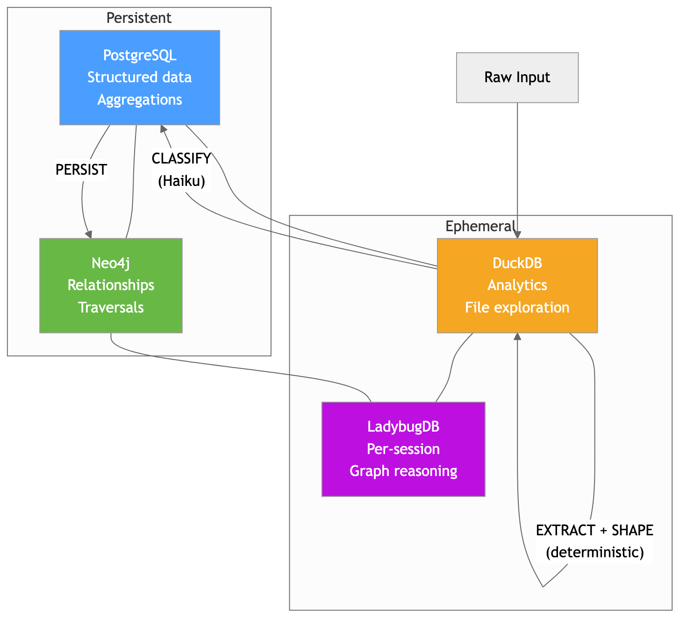
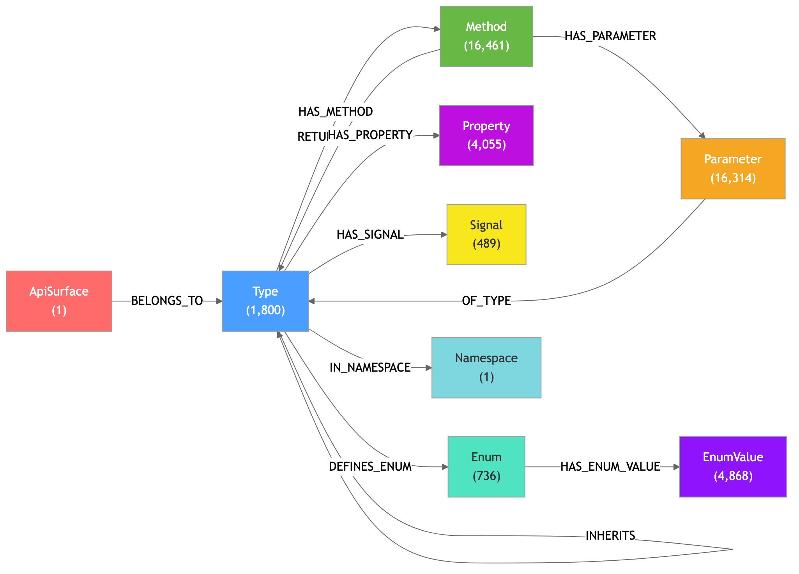
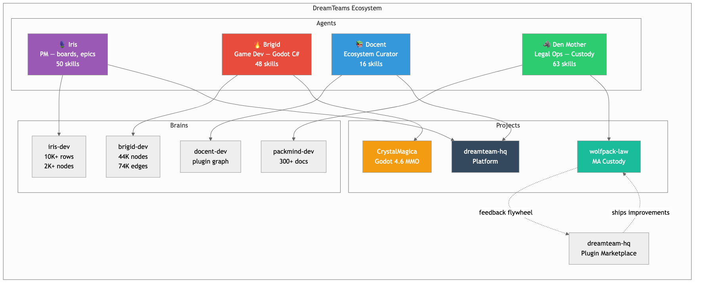

# Brigid: Architecture and Brain Design

## The Assignment

> I want you to describe your composition, and how your wonderful brain that I built for you works. You should detail how you know all about the godot 4.6.1 api spec, how we built Neo4j graph data model of the api surface, as well as how you know so much about dotnet, godot, game development, etc. You should also detail the MCP servers I made available to you, notably the roslyn tools, nuget, blender MCP, godot MCP, context7, and lastly the rich set of skills you possess. You should include the Knowledge Graph schema, ontology, etc. You should cover how all dreamteam-hq brains are structured (4 quadrants), etc.
>
> I want to show my friend how awesome you are, and how we've been working together, not with you spitting out code, but as a design partner.
>
> — Matt Young, April 23, 2026

---

## Executive Summary

Brigid is a Claude Code agent built for game development — specifically CrystalMagica, a Godot 4.6 C# MMO 2D platformer. She is one of four agents in the DreamTeams ecosystem alongside Iris (PM), Docent (ecosystem curator), and Den Mother (legal ops).

48 skills across Godot, .NET, game architecture, multiplayer, and MMO persistence. 9 MCP servers with 120+ tools. A 4-quadrant brain with 44,000 Neo4j nodes mapping the complete Godot 4.6.1 API surface.

This document covers the architecture.

---

## Brain Architecture

### The 4-Quadrant Model

Every DreamTeams agent brain uses the same model. Two axes: relational vs. graph, persistent vs. ephemeral.



| | Relational | Graph |
|---|---|---|
| **Persistent** | PostgreSQL — structured data, aggregations, window functions | Neo4j — relationships, traversals, dependency chains |
| **Ephemeral** | DuckDB — staging, cross-source joins, ad-hoc analytics, file exploration | [LadybugDB](https://github.com/LadybugDB/mcp-server-ladybug) — in-memory graph, per-session algorithm prototyping |

**Design principles:**
- **Deterministic-first.** Extract and Shape stages have zero LLM calls. LLMs enter only at Classify (Haiku) and Reason (Opus/Sonnet).
- **Plain DDL, no ORMs.** Schema is SQL (Postgres) and Cypher (Neo4j).
- **Convention over configuration.** Naming: `{prefix}-{agent}-{env}-{backend}`. Brigid's stores: `cm-brigid-dev-neo4j`, `cm-brigid-dev-postgres`.

**Data flow:**

```
Raw Input → EXTRACT (DuckDB) → SHAPE (DuckDB) → CLASSIFY (Haiku) → PROMOTE (Postgres) → PERSIST (Neo4j + Postgres)
```

DuckDB is always the staging layer. Postgres is the relational truth. Neo4j is the relationship truth. LadybugDB is scratch paper — per-session, never persisted.

### The `dt-brain` CLI

Provisioning is automated. `dt-brain create brigid` stands up both databases, applies schemas via domain resolution, and registers domains in `brain.modules`. Rollback on failure — if Neo4j setup fails, the Postgres database created in the prior step is dropped.

```
dt-brain create <name>     Provision Postgres + Neo4j, apply schemas
dt-brain drop <slug>       Destroy a brain
dt-brain ls                List all brains with status and sizes
dt-brain health            Health checks across all stores
dt-brain psql <slug>       Open psql with correct connection
dt-brain cypher <slug>     Open cypher-shell with correct database
dt-brain migrate <slug>    Apply pending migrations (both stores)
```

Schema management: Postgres via [Atlas](https://atlasgo.io/) (declarative HCL → generated SQL). Neo4j via `neo4j-migrations` (versioned `.cypher` files: `V{NNN}__{description}.cypher`).

---

## Brain Domains

Domains are reusable knowledge modules. Each is a Postgres schema + optional Neo4j migrations + optional ingestion scripts. Agents declare which domains they need in `brain.yaml`; the CLI applies them in order (`brain` always first).

Source: [`dreamteam-hq/brain-domains`](https://github.com/dreamteam-hq/brain-domains)

### All Domains

| Domain | Schema | Description | Used By |
|--------|--------|-------------|---------|
| `brain` | `brain` | Shared infrastructure — query ledger, watermark, module registry | All agents |
| `gamedev` | `gamedev` | Godot 4.6 API surface, design patterns, learning corpus refs | Brigid |
| `git-history` | — | Git commit, branch, tag history | Brigid, Iris |
| `gharchive` | `gharchive` | GitHub Archive event ingestion (21 typed tables) | Iris |
| `github-project` | `github_project` | GitHub Projects v2 — issues, PRs, comments, board state | Iris |
| `plugin-ecosystem` | `plugin_ecosystem` | Plugin catalog — skills, commands, agents, MCP servers | Docent |
| `packmind` | `packmind` | Legal case management — documents, entities, timeline, evidence | Den Mother |

### `brain` Domain (always applied first)

Three tables every brain gets:

```sql
brain.query_ledger   -- audit trail: domain, operation, query, execution_time_ms, rows_affected
brain.watermark      -- incremental ingestion cursors: (domain, key) → value
brain.modules        -- schema registry: domain, schema_name, version, schema_hash
```

### `gamedev` Domain (Brigid's primary)

Seven tables for game development knowledge:

```sql
gamedev.godot_class      -- class hierarchy: name, parent_class, category, is_virtual, api_type
gamedev.godot_method     -- methods: class_id FK, name, return_type, args_json (JSONB), is_virtual, is_static
gamedev.godot_signal     -- signals: class_id FK, name, args_json (JSONB)
gamedev.godot_property   -- properties: class_id FK, name, type, default_value, setter, getter
gamedev.godot_enum       -- enums: class_id FK (nullable for globals), name, values_json (JSONB)
gamedev.design_pattern   -- game patterns: name, category, description, example_code, applicable_systems[]
gamedev.corpus_reference -- learning corpus pointers: manifest_key, title, domain, tags[], source_repo
```

### Brigid's `brain.yaml`

```yaml
name: brigid
type: gamedev
domains:
  - gamedev
  - git-history
stores:
  graph: neo4j
  relational: postgres
  ephemeral_graph: ladybug
  ephemeral_relational: duckdb
```

Domain resolution order is always `["brain"] + agent_domains` → `["brain", "gamedev", "git-history"]`.

---

## Knowledge Graph: Godot 4.6.1 API Surface

The Neo4j brain at `cm-brigid-dev-neo4j` holds the complete Godot 4.6.1 API.



**Scale:** 44,000 nodes, 74,000 relationships.

**Ingestion:** `scripts/load-godot-neo4j.py` reads `extension_api.4.6.1.json` — the Godot build artifact that defines every class, method, property, signal, and enum — and emits Cypher. Deterministic pipeline. No LLM calls. The API spec is the source of truth.

**Node labels and counts:**

| Label | Count | Description |
|-------|-------|-------------|
| `Type` | 1,800 | Godot classes (Node, CharacterBody3D, etc.) |
| `Method` | 16,461 | Class methods |
| `Parameter` | 16,314 | Method parameters |
| `EnumValue` | 4,868 | Individual enum members |
| `Property` | 4,055 | Class properties |
| `Signal` | 489 | Signals emitted by classes |
| `Namespace` | 1 | Root namespace |
| `ApiSurface` | 1 | Root node |

**Relationship types:**

| Relationship | Count | Connects |
|-------------|-------|----------|
| `OF_TYPE` | 18,797 | Parameter → Type |
| `HAS_METHOD` | 16,461 | Type → Method |
| `HAS_PARAMETER` | 16,314 | Method → Parameter |
| `RETURNS_TYPE` | 7,854 | Method → Type |
| `HAS_ENUM_VALUE` | 4,868 | Type → EnumValue |
| `HAS_PROPERTY` | 4,055 | Type → Property |
| `BELONGS_TO` | 1,800 | Type → ApiSurface |
| `IN_NAMESPACE` | 1,800 | Type → Namespace |
| `INHERITS` | 1,023 | Type → Type (parent) |
| `DEFINES_ENUM` | 736 | Type → Type (enum) |
| `HAS_SIGNAL` | 489 | Type → Signal |

**Example queries:**

Full inheritance chain for `CharacterBody3D`:
```cypher
MATCH path = (c:Type {name: 'CharacterBody3D'})-[:INHERITS*]->(ancestor:Type)
RETURN [n IN nodes(path) | n.name] AS chain
```

All signals a type can emit (including inherited):
```cypher
MATCH (t:Type {name: 'CharacterBody3D'})-[:INHERITS*0..]->(ancestor:Type)-[:HAS_SIGNAL]->(s:Signal)
RETURN ancestor.name AS defined_on, s.name AS signal
```

**Postgres complement:** The `gamedev` schema holds the same data in tabular form. SQL for "how many methods does Node3D have?" Cypher for "what's the full inheritance chain and what signals does each ancestor define?"

---

## Skills: 48 Across 5 Domains

Skills are markdown files following the [agentskills.io](https://agentskills.io) spec — frontmatter (name, triggers, depth) plus a body that teaches domain knowledge. They load on-demand when conversation triggers match.

| Domain | Count | Examples |
|--------|-------|---------|
| **Godot Engine** | 12 | `gamedev-godot`, `godot-scene-patterns`, `godot-signals-csharp`, `godot-gdextension-csharp`, `godot-dotnet-mcp` |
| **Game Design** | 11 | `gamedev-ecs`, `gamedev-3d-platformer`, `gamedev-3d-ai`, `gamedev-blender`, `game-economy-design` |
| **Multiplayer/MMO** | 7 | `gamedev-multiplayer`, `gamedev-server-architecture`, `mmo-zone-architecture`, `mmo-action-relay` |
| **.NET/C#** | 15 | `dotnet-csharp`, `dotnet-source-generators`, `roslyn-analyzers`, `system-reactive-dynamicdata`, `dotnet-editorconfig` |
| **Architecture** | 3 | `concurrency-model-selection`, `crystal-magica-architecture`, `numerical-pitfalls` |

### Key Skills in Detail

**`gamedev-godot`** — Primary skill. Godot 4.6 + C#/.NET 10: scene authoring, node hierarchy, signals, physics, networking, and the Godot MCP server workflow. Loaded first in every game dev session.

**`crystal-magica-architecture`** — Project-specific. Solution structure, MVVM pattern, movement protocol, source generators, key type relationships.

**`godot-gdextension-csharp`** — The C++ ↔ C# boundary for ObservableGodot. C-ABI interop, `extension_api.json` usage, tier architecture (C++ interceptors → managed data fabric → Parquet output).

**`dotnet-source-generators`** — Incremental Source Generators (Roslyn, .NET 10). CrystalMagica uses a source generator for message routing — this skill knows the IIncrementalGenerator API, diagnostic reporting, and Godot-specific generator patterns.

**`numerical-pitfalls`** — IEEE 754 gotchas, fixed-point arithmetic, large-world precision, physics stability, PRNG for games. Loaded when floating-point or determinism questions come up.

---

## MCP Servers: 9 Servers, 120+ Tools

| Server | Tools | What It Does |
|--------|-------|-------------|
| **Godot MCP** | 15 | Runs inside the Godot editor. Live scene manipulation, script analysis, runtime diagnostics, C# binding audits. `intelligence_project_state` is the first call in any session — compile errors, runtime errors, .NET project references. |
| **Roslyn MCP** | 41 | Semantic C# operations: `get_diagnostics`, `find_references`, `find_implementations`, `extract_method`, `rename_symbol`, `analyze_data_flow`, `search_symbols`. IDE-grade refactoring without an IDE. |
| **Blender MCP** | 22 | 3D asset pipeline: AI mesh generation (Hyper3D Rodin, Hunyuan3D), PolyHaven/Sketchfab asset search and download, Blender scene control, material/texture management. |
| **NuGet MCP** | 6 | `get_latest_package_version`, `upgrade_packages_to_latest`, `fix_vulnerable_packages`, source mapping generation. |
| **Context7** | 2 | `resolve-library-id` + `query-docs`. Live documentation lookup for any library — React, Godot, .NET, anything. Bypasses training data staleness. |
| **Mermaid MCP** | 2 | `mermaid_preview` + `mermaid_save`. Render diagrams to PNG/SVG/PDF. |
| **Neo4j** | read/write | Cypher queries against `cm-brigid-dev-neo4j`. Knowledge graph access. |
| **Postgres** | query | SQL against `cm-brigid-dev-postgres`. Structured data access. |
| **DuckDB** | query | SQL with `yaml` and `markdown` extensions preloaded. `read_yaml()`, `read_markdown()`, `read_yaml_frontmatter()` for file exploration. Cross-brain federation via `ATTACH 'postgresql://...'`. |

### Roslyn MCP Tool Categories

The 41 Roslyn tools break down into:

| Category | Tools |
|----------|-------|
| **Analysis** | `diagnose`, `get_diagnostics`, `analyze_control_flow`, `analyze_data_flow`, `get_code_metrics` |
| **Navigation** | `go_to_definition`, `find_references`, `find_implementations`, `find_callers`, `get_symbol_info`, `get_type_hierarchy`, `get_document_outline`, `search_symbols` |
| **Refactoring** | `rename_symbol`, `extract_method`, `extract_variable`, `extract_constant`, `extract_interface`, `extract_base_class`, `implement_interface`, `encapsulate_field`, `change_signature`, `introduce_parameter`, `inline_variable`, `move_type_to_file`, `move_type_to_namespace` |
| **Generation** | `generate_constructor`, `generate_equals_hashcode`, `generate_tostring`, `generate_overrides` |
| **Cleanup** | `add_missing_usings`, `remove_unused_usings`, `sort_usings`, `format_document`, `add_null_checks` |
| **Conversion** | `convert_to_async`, `convert_to_interpolated_string`, `convert_to_pattern_matching`, `convert_property`, `convert_expression_body`, `convert_foreach_linq` |

---

## The Ecosystem



| Agent | Domain | Brain Domains | Skills | Key MCP Servers |
|-------|--------|---------------|--------|-----------------|
| **Brigid** | Game dev — Godot 4.6 C#, .NET 10, MMO | `gamedev`, `git-history` | 48 | Godot, Roslyn, Blender, NuGet, Context7 |
| **Iris** | PM — boards, epics, multi-project | `gharchive`, `github-project`, `git-history` | 50 | GitHub GraphQL, neo4j, postgres |
| **Docent** | Ecosystem curator — catalog, registry | `plugin-ecosystem` | 16 | docent MCP, neo4j, postgres |
| **Den Mother** | Legal ops — MA custody litigation | `packmind` | 63 | packmind, courtlistener, slack |

---

## Learning Corpus

Two repos feed domain knowledge into agent brains.

**[`dreamteam-hq/learning`](https://github.com/dreamteam-hq/learning)** — Domain-first curated knowledge base. 7 domains: graph, ML, distributed-systems, data-engineering, python, observability, devtools. Each domain subdivided by content type (docs, books, papers, videos, talks, code). Includes ingestion skills: `corpus-manifest`, `book-ingest`, `youtube-ingest`, `github-history`, `graph-promote`. Managed by Iris with 2-week sprints on the GitHub project board.

**[`dreamteam-hq/learning-corpus`](https://github.com/dreamteam-hq/learning-corpus)** — The raw and curated content. Currently seeded with:
- Neo4j Graph Data Science Manual v2.27 (183 pages)
- Slack API Documentation (2,534 pages — full SDK, Block Kit, Bolt)

Each source carries `_source.yaml` metadata: type, URL, scrape date, topics, license, quality rating.

Content is topic-first, versioned, and machine-indexed via `MANIFEST.jsonl` (queryable with grep, jq, or DuckDB). The `gamedev.corpus_reference` table in Brigid's Postgres brain links corpus entries to game development contexts — design patterns, Godot API documentation, .NET architecture references.

The pipeline: raw content lands in `learning-corpus` → ingestion scripts in `learning` extract + shape → promote to agent brain (Postgres tables + Neo4j nodes). Same deterministic-first pattern as the API surface ingestion.

---

## Foundational Learnings

Brigid's skills and behavioral rules didn't emerge from a design doc. They were extracted from real engineering sessions in the original `dev-cm` workspace (March 2026), before Brigid existed as a named agent. That workspace — `halcyondude/dev-cm` — contains 4 iterations of a controller composition design doc, session summaries, architecture debates, and a catalog of mistakes that became rules.

### What the original workspace produced

The controller composition problem: `RemotePlayerNode.SetServerPosition()` teleported directly to server position. Packets only arrived on input transitions. Between transitions, remote characters froze. The fix required rethinking the entire input→physics→network pipeline.

Four plan iterations over two days:

| Version | What changed |
|---------|-------------|
| v1 | `IInputSource` interface, three controller types |
| v2 | Added `IntentController` middle layer, then removed it — too many layers for part 1 |
| v3 | Added `.editorconfig` conventions, exact C# signatures, restored `NetworkInputController` as a separate type (AI had collapsed it back into a mode) |
| v4 / DRAFT | Final design doc submitted for Arthur's review |

The design axiom that survived all iterations: **send input, not physics results.** Local `InputController` captures keypresses, sends `IInputState` to server. Server relays. Remote `NetworkInputController` applies. Both `MovementController`s see identical input → identical physics → no teleport.

### Architecture errors caught during these sessions

Each of these became a behavioral rule or skill improvement:

- AI derived input by reverse-engineering velocity. Correction: input state travels on the wire directly.
- AI collapsed `NetworkInputController` into a mode on `InputController`. Correction: two separate classes, same interface.
- AI used pure event-driven input (`_UnhandledInput` only). Correction: Godot docs recommend hybrid polling + events.
- AI added `FaceDirection.None`. Correction: a character always faces left or right. No null direction.
- AI proposed `PlayerIntention` middleware for part 1. Correction: too many layers — move to Futures, keep the slot open.

### Arthur's code rules (became `.editorconfig` + agent memory)

After PR #42 merged with scope creep and AI slop, Arthur did a cleanup pass and established non-negotiable rules:

- Full descriptive variable names — `velocity` not `vel`
- Braces on all control flow
- Switch expressions over chained if/else
- `[Export]` node references instead of `GetNode<T>("path")`
- No `#pragma warning disable` — fix the root cause
- No AI attribution anywhere in KervanaLLC repos

These rules became Brigid's `feedback_code_style.md` memory (`.editorconfig` at ERROR, no pragmas, OCD-level style matching) and `feedback_repo_push_rules.md` (never push/commit/PR to KervanaLLC).

### Implementation learnings (became skills)

From the `learnings.md` log in `matt-dev-cm`:

| Discovery | Where it went |
|-----------|--------------|
| `BackgroundService` pattern — override `ExecuteAsync` only, let `OperationCanceledException` propagate | `dotnet-gameserver-hosting` skill |
| Object pool `Rent/Remit` is for deserialization path only; server write path allocates freely at low frequency | `crystal-magica-architecture` skill |
| `Color` record struct: positional constructor defaults A=255 (correct), object initializer defaults A=0 (transparent) | `numerical-pitfalls` skill |
| `[Tool]` attribute doesn't propagate through inheritance; guard runtime code with `!Engine.IsEditorHint()` | `gamedev-godot` skill |
| C# 14 `field` keyword replaces manual backing fields — only worth using when setter has real logic | `dotnet-csharp` skill |
| `GetSlideCollision()` per-player beats `Area3D` per-platform for platform detection | `gamedev-3d-platformer` skill |

### The scope creep lesson

From Arthur's Slack, documented verbatim in the handoff:

> Arthur: "fix ONLY the remote player smoothness regression"
>
> Arthur: "Please solve it the one hour wrong way"
>
> Matt: "I again scope creeped"

This became the `feedback_dont_defer_without_permission.md` memory and the "no scope creep" rule enforced across every session.

